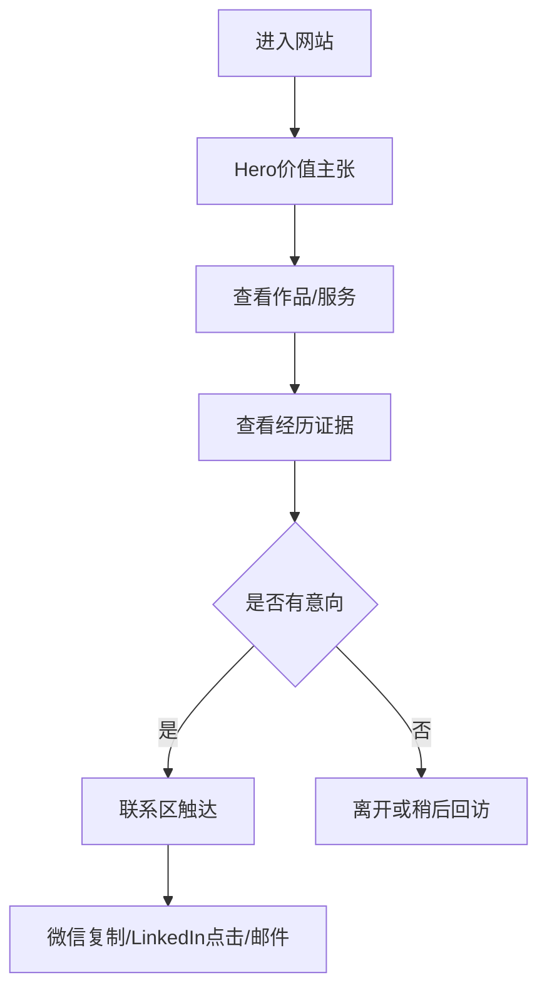

# 个人网站转化优化 PRD（V1）

| 字段 | 内容 |
|---|---|
| 文档版本 | v1.0 |
| 更新时间 | 2026-04-22 |
| 负责人 | Maropion / Codex |
| 适用页面 | `index v3.html` |
| 文档状态 | 评审版 |

---

## 一、概述（为什么做）

### 1.1 背景介绍
当前个人网站视觉完成度较高，但“主目标不聚焦、转化闭环不完整”：
- 存在多个 CTA 和沟通口径，用户下一步动作分散。
- 求职与接单并行但信息层级未完全区分，核心受众的决策路径不够短。
- 联系方式已完整，但“低摩擦触达 + 信任证明 + 明确交付边界”仍有提升空间。

### 1.2 产品概述
在不推翻现有视觉风格的前提下，对 `index v3.html` 做一轮“转化导向优化”，形成双目标漏斗：
- 主目标：求职（面试 / 内推）
- 副目标：接单（AI 产品与网页开发相关咨询）

### 1.3 产品目标
#### 1.3.1 业务目标（并行）
- 求职主目标：提升招聘方触达意愿与有效联系率。
- 接单副目标：稳定获得中高意向咨询线索。

#### 1.3.2 用户目标
- 招聘方可在 30-90 秒内判断“是否值得约聊”。
- 潜在客户可在 60-120 秒内判断“是否匹配其项目需求”。

#### 1.3.3 量化目标（本版设定，后续可替换）
> 说明：以下为首版运营目标口径（按你的要求先补齐可用数字），后续以真实埋点替换。

- `CV 下载点击率`：>= 12%
- `LinkedIn 点击率`：>= 8%
- `微信复制率`：>= 15%
- `有效联系率（任一联系行为）`：>= 22%
- `月度求职有效对话`：>= 8（含面试邀约/内推沟通）
- `月度接单咨询线索`：>= 3（副目标）

### 1.4 目标用户
- A 类：招聘经理 / HRBP / 用人主管（核心）
- B 类：团队负责人 / 创业者（副核心）
- C 类：同行与潜在推荐人（辅助传播）

### 1.5 文档阅读对象
- 产品：明确转化策略与优先级
- 前端：明确页面改造点与交互细节
- 运营：明确埋点与指标验证逻辑

---

## 二、产品描述（做什么）

### 2.1 需求范围
本期仅覆盖单页个人网站的内容策略与交互优化，不新增后台系统。

### 2.2 核心转化路径
1. 用户进入首页（Hero）
2. 快速判断价值主张（15 秒内）
3. 查看作品与经历证据（30-90 秒）
4. 触发联系动作（微信 / LinkedIn / 邮箱 / 下载简历）

### 2.3 版本规划
- V1（本次）：信息结构与文案转化优化、CTA 统一、埋点基础版
- V1.1：基于埋点做 A/B（Hero 文案、CTA 文案、联系区排序）
- V1.2：补充背书材料（推荐语/合作证明/案例下载）

### 2.4 功能清单（本期）
- F1：双目标信息架构重排（求职主、接单副）
- F2：首屏价值主张强化
- F3：项目卡“结果证据化”标准
- F4：服务卡“可交付化”标准
- F5：联系区低摩擦优化（微信优先 + LinkedIn 次优先）
- F6：转化埋点与数据看板字段定义

---

## 三、功能需求（怎么做）

### F1 信息架构与优先级
**用户故事**  
作为招聘方，我希望进入页面后优先看到与岗位匹配的信息，以便快速决定是否联系。

**方案**
- 导航与章节顺序保持：作品 > 服务 > 经历 > 联系（不增加学习成本）
- 在 Hero 与 Contact 明确“主路径（求职）/副路径（合作）”
- 所有核心文案遵循“对象-能力-结果”句式

**验收**
- 首屏 1 条主价值句 + 1 条次价值句，且不冲突。
- 全站主 CTA 文案统一，不超过 8 个汉字。

---

### F2 Hero 价值主张优化
**用户故事**  
作为招聘经理，我希望 10-15 秒内判断候选人是否具备 AI 产品落地能力。

**方案**
- 主文案：强调“可落地 + 周期 + 结果”
- 次文案：强调“求职方向 + 可承担职责”
- CTA 层级：
  - 主 CTA：`加微信沟通`
  - 次 CTA：`查看 LinkedIn`
  - 第三 CTA：`下载简历`

**文案示例（可直接替换）**
- 主文案：`AI 产品经理 / Builder，能在 2-4 周把需求落成可验收 MVP`
- 次文案：`求职倾向：面试 / 内推（主），同时承接 AI workflow 与网页开发项目（副）`
- 求职倾向文案样式：小一号展示（建议 `12-13px`，弱于主标题与主卖点）

**验收**
- Hero 区 CTA 不超过 3 个。
- 主 CTA 点击面积 > 40px 高，移动端可点击性通过。

---

### F3 作品集“结果证据化”
**用户故事**  
作为用人方，我希望每个项目都有明确产出和量化结果，避免只看叙述性描述。

**方案**
- 每个项目补充统一结构：
  - 场景 / 我的角色 / 周期
  - 关键动作（1-2 条）
  - 结果指标（1-2 条）
- 项目标题字号统一，过长标题做两行截断与行高规范。

**结果指标示例（可替换）**
- `评审平均时长 -> 5min`
- `AI workflow 平均节省 70% 人工耗时`（如非百分比，按你后续口径改）
- `竞品研究覆盖 20+ 产品，输出 3 阶段路线图`

**验收**
- 4 个项目卡全部具备“角色+周期+结果”。
- 同级标题字体、行高、粗细一致。

---

### F4 服务卡“可交付化”
**用户故事**  
作为潜在客户，我希望知道你能交付什么、多久交付、我需要提供什么。

**方案**
- 将服务卡从“能力描述”改为“服务包”描述：
  - `AI 产品 / 网页开发`
  - `AI Workflow 搭建`
  - `深度竞品 / 行业调研`
- 每卡增加：输入条件、交付物、参考周期

**示例模板**
- 输入：业务目标 + 现有资料
- 交付：PRD/原型/可运行页面/调研报告
- 周期：7-14 天（视范围）

**验收**
- 4 张服务卡标题和正文左边界对齐。
- Hover 动效保留，默认态不出现冗余外框。

---

### F5 联系区转化优化（微信优先 + LinkedIn 次优先）
**用户故事**  
作为意向用户，我希望在最短路径内完成联系动作。

**方案**
- 联系卡排序：微信、LinkedIn、邮箱、GitHub
- 微信卡保留“点击复制 + toast”
- LinkedIn 卡强化可见性（颜色权重略高于其他次级卡）
- 保留粉色 hover glow，但控制阴影半径避免“过大失真”

**验收**
- 联系卡尺寸保持精致感，不破坏全站密度（当前基础上仅做小幅微调）。
- 微信复制后 1 秒内出现反馈，2 秒自动消失。

---

### F6 埋点与数据
**埋点事件（基础）**
- `cta_click_wechat`
- `cta_click_linkedin`
- `cta_click_email`
- `cta_click_cv_download`
- `project_link_click`
- `lang_toggle`

**事件字段**
- `timestamp`
- `section`
- `cta_name`
- `lang`
- `device_type`
- `referrer`

**验收**
- 所有 CTA 至少可上报 1 条点击事件。
- 错误不阻断页面主流程（埋点失败静默降级）。

---

## 四、非功能需求

### 4.1 性能
- 首屏关键内容在 2.5s 内可见（桌面网络常规条件）。
- 图像资源保留压缩版，避免新增大体积资源导致加载抖动。

### 4.2 兼容性
- 桌面端优先（当前设计主战场）。
- 移动端保证可读与可点，不强求完全一致视觉。

### 4.3 可维护性
- 样式按区块注释清晰，避免重复选择器多轮覆盖。
- 时间轴对齐逻辑收敛到单一规则，避免继续靠多次微调累积偏移。

### 4.4 风险与应对
- 风险：求职与接单文案冲突导致定位模糊。  
  应对：主副目标明确标注，主 CTA 永远服务求职主目标。
- 风险：量化数字缺乏证据支撑。  
  应对：先作为运营目标口径，后续用真实项目数据替换。

---

## 五、验收标准与测试要点

### 5.1 业务验收
- 用户可在 90 秒内完成至少一次联系动作。
- 招聘方路径（Hero -> 经历 -> 联系）可在 3 次滚动内闭环。

### 5.2 页面验收
- 字体层级统一：同级标题样式一致。
- 时间轴节点与对应标签视觉对齐（尤其偶数行）。
- 联系区 hover 反馈统一、不过曝、不卡顿。

### 5.3 数据验收
- 核心 CTA 点击有数据回传。
- 可按“渠道/语言/设备”拆分查看。

---

## 待确认项清单

### 必须确认（阻塞长期版本）
1. [已确认] 求职倾向在 Hero 显式写明，且使用较小字号弱化展示。
2. [待确认] 微信二维码弹层素材与展示样式，待你后续同步。

### 建议确认（影响转化效率）
3. [部分确认] 可公开指标先使用：`评审时长 5min`、`AI workflow 平均节省 70%`。
4. [待确认] 是否允许增加“可面试时段 / 常驻城市 / 远程可用性”模块。

### 可后续补充
5. [待确认] 推荐语或背书素材（如前同事/合作方引用）。
6. [待确认] 接单服务是否展示“起步价区间”。
